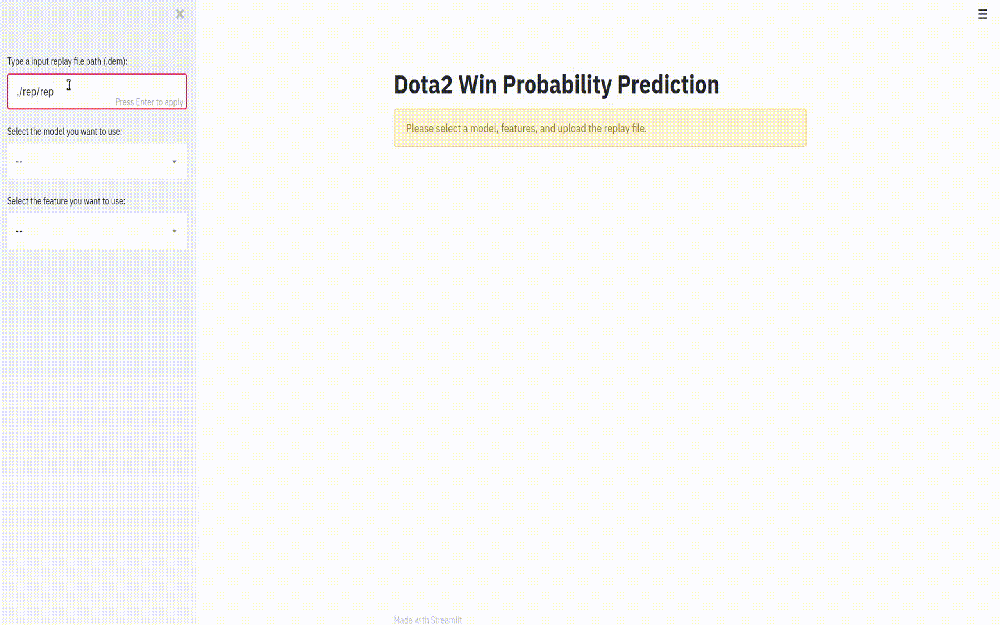
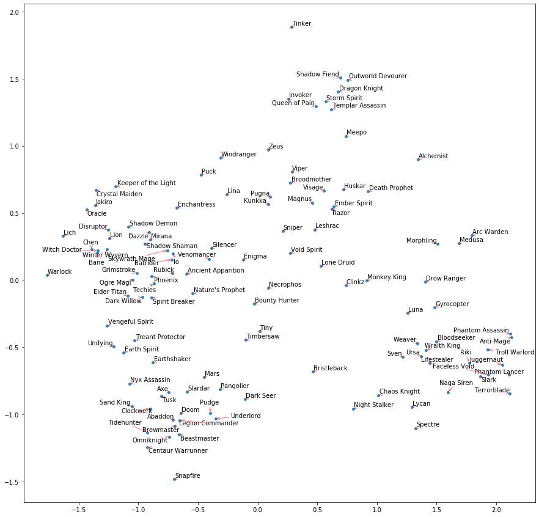

# Dota2 Win Probability Prediction Using Replay Files

# Table of Contents
1. [Motivations](README.md#motivations)
2. [Overview of the Project](README.md#overview-of-the-project)
3. [Repo Structure](README.md#repo-structure)
4. [Requirements](README.md#requirements)
5. [Setup](README.md#setup)
6. [Run A Train and Test](README.md#run-a-train-and-test)
10. [Details of the Implementation](README.md#details-of-the-implementation)

This project trained and provided models to predict and plot the win probability of both teams over time, given the replay file of a specific game.

To check-out the repo:

```
git clone https://github.com/henryhao1991/Dota2-Win-Probability-Prediction.git
```

## Motivations

E-sports is a rapidly growing field and draws a lot of public attention this year. Dota2 has a subscription service called DotaPlus, including a feature that shows a real time win probability graph, but its algorithm is not revealed. I would like to build a model that train from the replay files to do the similar task: given the time and game information, predict the win probability of both teams.

## Overview of the Project

In this project, I trained LSTM models that takes the processed inputs from a game replay, and predict the win probability of Radiant side (In Dota2, players joins two teams, Radiant and Dire). The details of the implementations (data processing, models, etc.) are provided at the end.

The deliverable of the project is a Streamlit App that allows user to specify a replay file, and then parses the file and generates the win probability graph using the selected model. The example of how the App looks like is shown below.

<p float="left">
  
</p>

## Repo Structure

Below is the structure of this repo.

    ├── README.md
    ├── images
    │   └── Images used for readme
    ├── model
    │   └── __init__.py
    │   └── model.py
    │   └── hero2vec.py
    ├── util
    │   └── __init__.py
    │   └── dataloader.py
    │   └── data_process.py
    ├── saved_model
    │   └── hero_embeddings.txt    
    │   └── model_agg.pt
    │   └── model_indi.pt
    │   └── model_agg_h2v_subnet.pt
    │   └── model_indi_h2v_subnet.pt
    ├── results_notebooks
    │   └── hero2vec_result.ipynb
    │   └── LSTM_training.ipynb
    │   └── results_comparison.ipynb
    ├── h2v_training.py
    ├── training.py
    ├── streamlit_demo.py
    └── setup.sh

## Requirements

```
pytorch==1.0.1
numpy==1.17.3
scikit-learn==0.22
matplotlib==3.1.2
```

For the Streamlit App:

```
streamlit==0.54.0
plotly==4.5.0
```

Optional (For better text arrangement of hero2vec result):

```
adjusttext==0.7.3.1
```

## Setup

Under the main folder, run:

```
bash setup.sh
```

If issues occurs with installing pytorch, please refer to http://pytorch.org/ for installation of pytorch, and comment out the line

```
pip3 install torch torchvision
```

## Run A Train and Test

The example code of how to train and check the results can be found in the Jupyter notebooks under results_notebooks folder.

To run the Sreamlit App, first clone the repo of the parser provided by OpenDota:

```
git clone https://github.com/odota/parser.git
```

Then navigate to the /script folder and run the script rebuild.sh.

Under the main folder, run:

```
streamlit run streamlit_demo.py
```

And it will open up in the browser.

To get the replay file (.dem format), either download it in the game client, or get the download address using OpenDota's API: https://docs.opendota.com/#tag/matches

## Details of the Implementation

- Raw data: Replay files (.dem format). Fetched using OpenDota's API.
<br/>
- Data processing pipeline:
  * Parse the replay file using a script provided by OpenDota:
    https://github.com/odota/parser
  * Get the game information every 30 second from the parsed JSON file.
  * Extract useful information from the 30-second-interval entries.

  All the data processing funtion can be found in data_process.py
<br/>
- Selected features (Used either team features or individual features):
  * Team features: Team total gold and experience, number of players died on both teams, number of towers destroyed on both teams
  * Individual features: Individual gold and experience, number of players died on both teams, number of towers destroyed on both teams
  * Team embeddings: An vector embedding for heroes is trained. The graph below shows the results of the embedding in 2 eigenvector directions corresponding to the 2 largest eigenvalues of PCA. We can see, the results clustered based on the preferred roles for different heros (carries, mid-lane, off-lane, supports), while the more flexible heroes lies in the middle of their usual roles.
<br/>
  <p float="left">
    
  </p>

- Model used:
  * Heuristic model: Just a baseline model to compare with. Simply return the output of a Sigmoid function over the total difference of gold and experience between two teams dividing by a scaling factor.
  * LSTM model: A single layer LSTM network, with 50 hidden nodes.
  * LSTM model with subnet for team embeddings: The LSTM network plus a feed forward subnet with the team embeddings as the input. The results of both network are concatenated and are passed to a fully connected layer.
