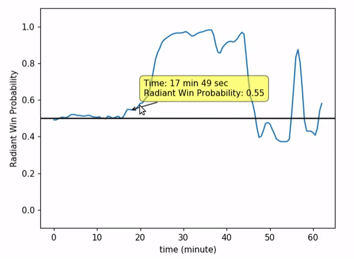

# Dota2 Win Probability Prediction Using Replay Files

This project trained and provided models to predict and plot the win probability of both teams over time, given the replay file of a specific game. The example graph is shown below.

<p float="left">
  
</p>

To check-out the repo:

```
git clone https://github.com/henryhao1991/Dota2-Win-Probability-Prediction.git
```

## Motivation for the Project

E-sports is a rapidly growing field and draws a lot of public attention this year. Dota2 has a subscription service called DotaPlus, including a feature that shows a real time win probability graph, but its algorithm is not revealed. I would like to build a model that train from the replay files to do the similar task: given the time and game information, predict the win probability of both teams.

## Overview of the Project

In this project, I trained LSTM models that takes the processed inputs from a game replay, and predict the win probability of Radiant side (In Dota2, players joins two teams, Radiant and Dire).

Details of the implementation:

- Raw data: Replay files (.dem format). Fetched using OpenDota's API.

- Data processing pipeline:
  * Parse the replay file using a script provided by OpenDota

## Requirements

## Run A Train and Test

## Results
